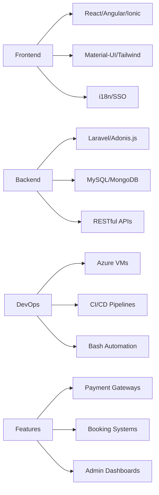

<div align="center">
  
</div>

<div align="center">
  
### 💻 Full-Stack Developer | 🚀 Problem Solver | ☁️ Cloud Enthusiast

[](https://chaitanya-patil-portfolio.netlify.app)
[](https://www.linkedin.com/in/chaitanya-patil-3508a021a/)
[](mailto:chaitanya.ypatil@gmail.com)
[](https://leetcode.com/cpatil27112001/)


</div>

---

## 👨‍💻 About Me

```typescript
const chaitanya = {
    location: "Pune, India 🇮🇳",
    role: "Software Engineer @ Travelx.ai",
    experience: "2.7+ years",
    education: "B.Tech in Computer Science (GPA: 8.5/10)",
    
    expertise: [
        "Scalable React & Angular Applications",
        "Cross-Platform Mobile Development (Ionic)",
        "Backend Architecture (Laravel, Adonis.js)",
        "Cloud Deployment & DevOps (Azure)",
        "Payment Gateway Integration",
        "Internationalization (i18n)"
    ],
    
    achievements: [
        "🏆 Smart India Hackathon Winner 2022",
        "📈 Improved app performance by 40%",
        "💼 Boosted sales conversions by 20%",
        "🚀 Enhanced productivity by 30%",
        "👥 Mentored 2+ interns"
    ],
    
    currentlyBuilding: "End-to-end booking systems for travel platforms",
    learning: "Advanced Azure DevOps & Microservices Architecture",
    
    funFact: "I turn coffee into code ☕ → 💻"
};
```

<div align="center">

### 🎯 Quick Highlights

| 💼 Experience | 🏆 Achievements | 🌟 Focus |
|:-------------:|:---------------:|:--------:|
| 2.7+ Years | Hackathon Winner  | Performance & UX |

</div>

---

## 🛠️ Tech Arsenal

<details open>
<summary><b>🎨 Frontend Development</b></summary>
<br>


</details>

<details open>
<summary><b>⚙️ Backend Development</b></summary>
<br>


</details>

<details open>
<summary><b>☁️ DevOps & Cloud</b></summary>
<br>


</details>

<details open>
<summary><b>🔧 Tools & Technologies</b></summary>
<br>


</details>

---

## 📊 GitHub Analytics

<div align="center">
  
  
</div>

<div align="center">
  
</div>

<div align="center">
  
</div>

### 📈 Contribution Stats

<div align="center">
  
</div>

<div align="center">
  
  
  
</div>

---

## 💼 What I Do Best

<table>
<tr>
<td width="50%" valign="top">

### 🎨 Frontend Excellence
```javascript
✨ Scalable React Applications
   • Material-UI Integration
   • Advanced Search & Pagination
   • Dynamic Theming
   • Centralized API Management
   • Internationalization (i18n)

📱 Cross-Platform Development
   • Ionic + Angular Apps
   • Responsive Design
   • SSO Implementation
   • Performance Optimization
```

</td>
<td width="50%" valign="top">

### ⚙️ Backend Mastery
```php
🔐 Secure Server Architecture
   • Laravel & Adonis.js
   • RESTful API Design
   • Role-Based Access Control
   • Custom CRUD Commands
   • Email Verification Systems

💳 Payment Integration
   • Multiple Gateway Support
   • Secure Transactions
   • User-Friendly Processing
```

</td>
</tr>
<tr>
<td width="50%" valign="top">

### ☁️ DevOps & Deployment
```bash
🚀 Azure Cloud Deployment
   • Ubuntu VM Automation
   • Bash Script Optimization
   • CI/CD Pipeline Setup
   • Minimal Downtime Strategy
   • Operational Efficiency
```

</td>
<td width="50%" valign="top">

### 📊 Dashboard Development
```typescript
📈 Feature-Rich Admin Panels
   • Authentication Systems
   • Role Management
   • Automated Reporting
   • Email Workflows
   • 30% Productivity Boost
```

</td>
</tr>
</table>

---

## 🚀 Featured Projects

<div align="center">

### 🏨 Travelx.ai - Travel E-Commerce Platform
[]()
[]()
[]()
[]()
[]()

</div>

**Professional Project** | *July 2023 - Present*

#### 🎯 Key Achievements & Responsibilities

**Frontend Development:**
- 🎨 Engineered scalable React applications with Material-UI, integrating advanced search, pagination, and dynamic theming
- 📱 Built responsive cross-platform apps using Ionic + Angular with internationalization (i18n) support
- 🔐 Implemented Single Sign-On (SSO) for streamlined authentication and enhanced access control
- ⚡ Achieved **40% faster load times** through performance optimization

**Backend Architecture:**
- 🛡️ Developed secure, high-performance server-side logic using Laravel and Adonis.js
- 📊 Created customizable dashboards with robust authentication, role-based access management, and automated reporting
- ⚙️ Built custom commands to streamline CRUD operations, improving productivity by **30%**
- ✉️ Implemented email verification and workflow automation systems

**Booking Systems:**
- ✈️ Developed end-to-end booking features for flights, hotels, and tours across web and mobile platforms
- 💳 Integrated multiple secure payment gateways for seamless transaction processing
- 📈 Increased sales conversions by **20%** through UX/UI enhancements

**DevOps & Deployment:**
- ☁️ Automated Azure Ubuntu VM deployments using optimized bash scripts
- 🔄 Set up CI/CD pipelines, significantly reducing deployment time and minimizing downtime
- 📊 Ensured scalability and data security across all platforms

**Team Leadership:**
- 👥 Mentored 2+ interns through task assignment, code reviews, and best practices training
- 📚 Fostered knowledge growth and quality contributions within the development team

**Impact:** Serving thousands of daily users with 99.9% uptime and seamless global experience

---

<div align="center">

### 📅 Event Manager Platform
[]()
[]()
[]()

</div>

**Freelance Project**

- 💼 Full-featured event management system with registration & payment processing
- 👨‍💼 Comprehensive admin panel for event oversight and real-time analytics
- 🎨 Modern, intuitive UI built with Material-UI and responsive design
- 📈 Boosted efficiency by **20%** and user satisfaction by **30%**
- 🔐 Secure authentication and role-based access management

---

<div align="center">

### 🔐 Smart Authentication System
[]()
[]()
[]()
[]()

</div>

**🏆 Smart India Hackathon Winner 2022**

- 🤖 Advanced facial recognition authentication system with 95%+ accuracy
- 👋 Intuitive gesture-controlled computer access using MediaPipe
- 🎮 Comprehensive gesture mapping for system functions
- 🛡️ Enhanced security with personalized access controls
- 💻 Seamless user experience across varied lighting conditions

**Technologies:** Python, OpenCV, TensorFlow, MediaPipe, MongoDB

---

## 💼 Professional Experience

<table>
<tr>
<td width="50%">

### 🏢 Travelx.ai, Pune
**Software Engineer**  
*July 2023 - Present*

**Core Responsibilities:**
- ✅ Full-stack development with React, Angular & Ionic
- ✅ Backend architecture with Laravel & Adonis.js
- ✅ Performance optimization (40% improvement)
- ✅ Payment gateway integrations
- ✅ Azure cloud deployment automation
- ✅ Team mentorship & code reviews
- ✅ End-to-end booking system development

</td>
<td width="50%">

### 🎓 Education
**SGGS Institute of Engineering & Technology**  
*B.Tech in Computer Science*  
*Aug 2019 - Jun 2023*

**GPA: 8.5/10**

**Highlights:**
- 🏆 Smart India Hackathon Winner
- 📚 Strong foundation in DSA & system design
- 💻 Multiple hands-on projects
- 🎯 Active coding community participant

</td>
</tr>
</table>

---

## 🏆 Achievements & Impact

<div align="center">

| 🏅 Achievement | 📅 Timeline | 📝 Impact |
|:--------------|:-------:|:---------------|
| 🥇 Smart India Hackathon Winner | 2022 | Facial recognition authentication system with 95%+ accuracy |
| ⚡ Performance Optimization | 2023-25 | 40% faster load times through code splitting & lazy loading |
| 🚀 Productivity Enhancement | 2023-24 | 30% improvement via custom CRUD commands & automation |
| 👥 Team Mentorship | 2023-24 | Successfully guided 2+ interns to quality contributions |
| ☁️ Deployment Automation | 2023-25 | Minimized downtime with optimized Azure bash scripts |

</div>

---

## 📈 Technical Proficiencies

<div align="center">



</div>

---

## 📫 Let's Connect!

<div align="center">

### I'm always open to interesting conversations and collaboration opportunities!

[](https://www.linkedin.com/in/chaitanya-patil-3508a021a/)
[](https://chaitanya-patil-portfolio.netlify.app)
[](mailto:chaitanya.ypatil@gmail.com)
[](https://leetcode.com/cpatil27112001/)


</div>

---

## 💭 Philosophy

<div align="center">
  
> *"The best way to predict the future is to invent it."*  
> **— Alan Kay**

### 🚀 Let's build scalable solutions together!

</div>

---

<div align="center">
  
</div>

<div align="center">
  
⭐️ From [ChaitanyaYuvrajPatil](https://github.com/ChaitanyaYuvrajPatil) | Crafted with 💙 and ☕

</div>
